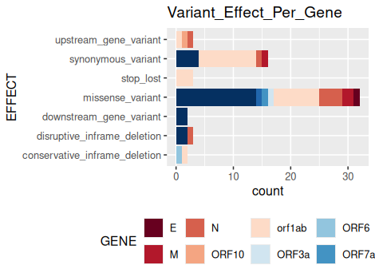
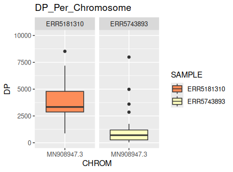

***

# NGS Pipeline Training Documentation

This document describes the workflow undertaken during training for the 'Bioinformatics for Biologists: Analysing and Interpreting Genomics Datasets' course provided by Wellcome Connecting Science.

# Disclaimer

This repository is created solely for educational purposes and to document my personal learning journey. All content, scripts, and workflows are either my own work or properly referenced. I do not claim ownership of any original software, tools, or data used, and have referenced external resources where applicable. This repository is not intended for commercial use or distribution.

## Purpose

To understand the workflow involved in a **Next-Generation Sequencing (NGS) pipeline**, including the various file formats and tools used throughout the process.

## Objectives

- To select **Nextflow** as the primary workflow language and use the **nf-core/viralrecon** pipeline to perform assembly and variant calling for SARS-CoV-2 sequencing data.
- To obtain and analyze the results generated by the pipeline, visualizing the data using **ggplot2** in **R Studio**.


## Tools Used

- Conda
- Nextflow
- Docker
- R Studio
- SRA Toolkit
- MultiQC

**Operating System:** Ubuntu 24.04.2 LTS

## Workflow Overview

1. Create conda environments with all necessary dependencies and packages required for NGS analysis.
2. Download FASTQ files of SARS-CoV-2 using the SRA Toolkit.
3. Run the **nf-core/viralrecon** pipeline.
4. Analyze the MultiQC report.
5. Visualize variant data using ggplot2 in R Studio.

## Sample Dataset

The dataset consists of SARS-CoV-2 sequences from a cohort of 16 samples, including 10 CDC-defined Variants of Concern (VOC) and Variants of Interest (VOI). This dataset is used to validate lineage calling pipelines.
For more information, see: [CDC SARS-CoV-2 Datasets](https://github.com/CDCgov/datasets-sars-cov-2).

**For practice purposes, two representative samples are used:**

- ERR5743893
- ERR5181310


## Execution

### Environment Setup

```bash
# Download the MOOC.yml file containing necessary packages

# Create a Conda environment named 'MOOC' using MOOC.yml
conda env create -n MOOC --file MOOC.yml

# Activate the Conda environment
conda activate MOOC
```


### FASTQ Files Download

```bash
# Create a text file with accession IDs for the samples
echo -e "ERR5743893\nERR5181310" > samples.txt

# Download paired-end FASTQ files for all samples in samples.txt
for i in $(cat samples.txt); do fastq-dump --split-files $i; done

# Compress the FASTQ files
gzip *.fastq

# Move compressed FASTQ files to 'fastq_data'
mkdir fastq_data
mv *.fastq.gz fastq_data
```


### Preparing the Samplesheet

```bash
# Download the samplesheet preparation script from the nf-core/viralrecon repository
wget -L https://raw.githubusercontent.com/nf-core/viralrecon/master/bin/fastq_dir_to_samplesheet.py

# Run the script to generate the samplesheet for paired-end data
python3 fastq_dir_to_samplesheet.py fastq_data samplesheet.csv -r1 _1.fastq.gz -r2 _2.fastq.gz

# The samplesheet should contain:
# sample,fastq_1,fastq_2
# ERR5181310,fastq_data/ERR5181310_1.fastq.gz,fastq_data/ERR5181310_2.fastq.gz
# ERR5743893,fastq_data/ERR5743893_1.fastq.gz,fastq_data/ERR5743893_2.fastq.gz
```


### Running nf-core/viralrecon

```bash
# Install Nextflow through Conda
conda create --name nextflow nextflow
conda activate nextflow

# Run the pipeline (adjust memory and CPU as needed; I have used Docker profile for better compatibility)
nextflow run nf-core/viralrecon -profile docker \
  --max_memory '4.GB' --max_cpus 2 \
  --input samplesheet.csv \
  --outdir results/viralrecon \
  --protocol amplicon \
  --genome 'MN908947.3' \
  --primer_set artic \
  --primer_set_version 3 \
  --skip_assembly \
  --skip_asciigenome \
  --platform illumina \
  -resume
```


### Output Files

- `results/viralrecon/multiqc/multiqc_report.html`
- `results/viralrecon/variants/variants_long_table.csv`


## Results and Report Inference

### MultiQC Report

- MultiQC aggregates outputs from multiple tools into a single graphical summary.
- Shows overall statistics per sample and step.
- Let us have a brief glance on the stats obtained from each tool.

#### FastQC

- No host (human) contamination detected
- Most of the reads (> 94%) mapped to the reference
- No adapter contamination
- High quality scores; most reads: length 197–221 bp


#### fastp

- Majority of reads passed filters for both samples
- Highest insert size: 388 bp


#### Kraken2

- No human DNA detected


#### Bowtie2

- Most reads mapped after quality trimming


#### Pangolin

| Sample | Pangolin Lineage |
| :-- | :-- |
| ERR5743893 | B.1.617.1 |
| ERR5181310 | B.1.525 |

#### SnpEff

- Lists distribution, impact, and effect of detected variants


### Variant Analysis

Important variant information for each sample is found in `variants_long_table.csv`. These results can be visualized using R and ggplot2.

#Distribution of variant types across genes



The bar plot here represents variant distribution.

# Total read depth per chromosome



The box plot above represents the depth of coverage per chromosome in each of the samples.

## References

- https://doi.org/10.5281/zenodo.7764938
- https://www.futurelearn.com/courses/bioinformatics-for-biologists-analysing-and-interpreting-genomics-datasets
- https://nf-co.re/viralrecon/2.6.0/


